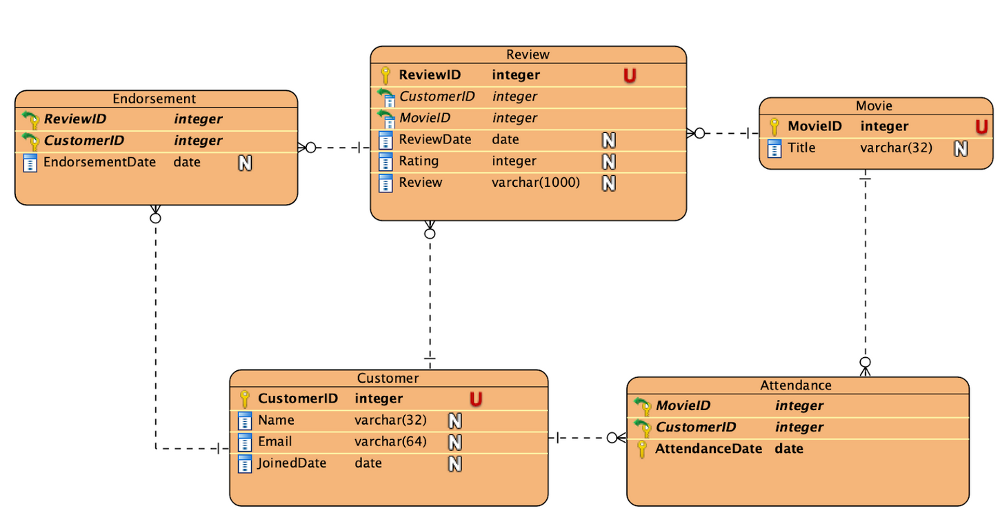

## iRate: Database of a Movie Rating System

Yuting, Chuhan and Xuefang

**Introduction**

This project "iRate" is a portion of an application that enables registered movie theater customers to rate a movie that they saw at the theater, and for other registered customers to vote for reviews.

iRate is a social media application that encourages theater customers to rate a movie that they saw at the theater in the past week and write a short review. Other customers can vote one review of a particular movie as "helpful" each day.

The writer of the top rated review of a movie written three days earlier receives a free movie ticket, and voting is closed for all the reviews of the movie written three days ago. Someone who voted one or more movie reviews as "helpful" on a given day will be chosen to receive a free concession item.

**_Highlights of the project_**

*   Derby RDBMS
*   Java 

The project is to develop and document a data model for representing entities and relationships in this promotional social media application, provide DDL for creating the tables, DML for editing entries in the tables, and DQL for making commonly used queries to retrieve information about the status of reviews and votes from the database.

 

The data model for the project is based on the concept of registered customers, movies seen by a customer, reviews written by a customer, and votes cast by other customers for a given movie.

**Procedure**

Assuming you are using IntelliJ or other similar IDE.

- Start a new project with IntelliJ
- Add `derby.jar` to the external library. This step can be found on course web page of CS5200.
- You can run `MainPage.java` and `Test.java` according to `Test Plan.md` or test result files in folder `Tests`.
  - If input is invalid or inaccurate, error message will be prompted.
  - if input is valid, more options will be provided and just follow the instructions.
- Have fun!

**Diagram**

**Classes**

*   Tables: new connection creation and database initialization by creating all five tables and stored functions.
*   DBFunctions: helper functions that are needed to create tables
*   PubUtil: helper functions for printing information and inserting data
*   PubAPI: load default data from file and print all tables
*   MainPage: main page with multiple options
*   CustomerFunctions: functions for customers that enable account management, customer activity and data exploring.
*   CustomerHelper: helper functions for CustomerFunctions
*   TheaterFunctions: functions for theater employees that enable movie management, theater activity and data exploring.
*   TheaterHelper: helper functions for TheaterFunctions
*   Test: test of DBfunctions by checking constraints of each table.

**TextFiles (for loading data)**

*   iRate_attendance.txt,  which contains 16 attendances.
*   iRate_customer.txt, which contains 6 customers.
*   iRate_endorsement.txt, which contains 17 endorsements.
*   iRate_movie.txt, which contains 6 movies.
*   iRate_review.txt, which contains 11 movies.

**Tables**

*   Entity table: Customer, Movie
*   Relation table: Attendance, Review, Endorsement

**Stored Functions**

*   isValidEmail
*   isValidAttendance
*   checkReviewDate
*   isFirstReview
*   isValidRating
*   isEndorseAllowed

