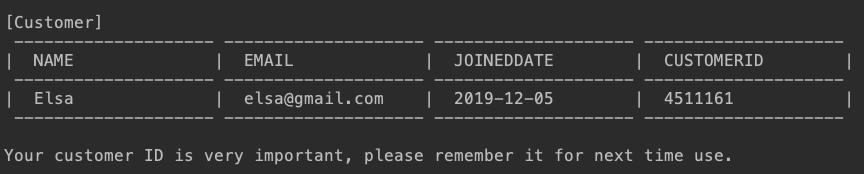
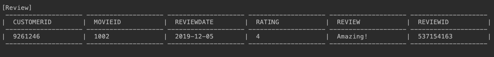
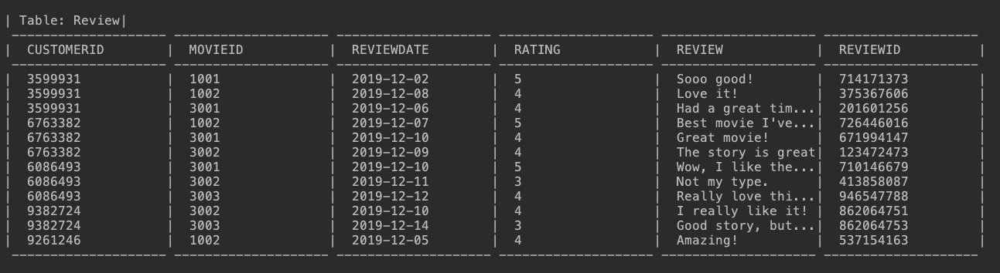
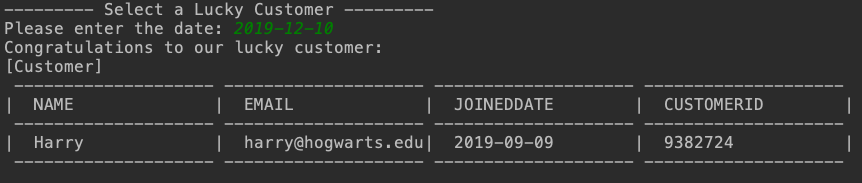

## Test Result of Part II: User Functions

This document contains detailed instructions for running test of user functions.

You can run test of DB Functions by running `MainPage.java`. You will encounter a welcome page:

```
--------------------------------------
WELCOME TO IRATE MOVIE RATING SYSTEM
--------------------------------------
1. Initialize all tables
2. Load sample data
3. Print all tables
4. Log in as customer
5. Log in as an employee at theater
6. Exit program
Enter your choice: 

```

You will first initialize the test by:

- Creating tables by choosing `1`.

```
Dropped all constraints.
Dropped all functions.
Dropped all tables.
Created all functions: [isValidEmail, isValidAttendanceDate, checkReviewDate, isReviewAllowed, isFirstReview, isValidRating,  isEndorseAllowed]
Created all tables: [Endorsement, Review, Attendance, Movie, Customer]
```


- Loading sample data by choosing `2`.

```
Cleared all tables.
Loaded 6 customers.
Loaded 6 movies.
Loaded 16 attendances.
Loaded 11 reviews.
Loaded 17 endorsements.
```


- You can print all tables by choosing `3`.

  

#### Customer Functions

Choose `4` in Main Page to login as customer, you will encounter:

```
Are you a new user? (y/n)
```

Enter `y` to register:

```
Registering an account...

Please input an account name:
>>> Elsa


Enter your email address(for example: abcd@gmail.com): 
>>> elsa@gmail.com
```

Then you will see your customer information as below:




Then you will be directed to customer main page:

```
--------- Options for Customer ------------
1. Show account information
2. Check in the movie you watched
3. Write a review
4. Endorse a review
5. Show highest rating movies
6. Delete my account
7. Exit customer page
Enter your choice: 
```


You can also delete your account by choosing 6. Your account information will be shown again and you will be asked to confirm your deletion.

```
Are you sure you want to delete your account? (y/n)

>>> y

Deleted customer: 4511161
```


##### Activity: 

- Enter `2` to check in the movie you watched

  all the available movie will be shown:

```
| Table: Movie|
 -------------------- --------------------
|  TITLE             |  MOVIEID           |
 -------------------- --------------------
|  Frozen            |  1001              |
|  Frozen2           |  1002              |
|  Avengers          |  2001              |
|  StarWars          |  3001              |
|  StarWars2         |  3002              |
|  StarWars3         |  3003              |
 -------------------- --------------------
```

​	Enter the attendance information:

```
Please enter the movie id of the movie you watched: 
>>> 1002
The date you watched the movie: 
format: YYYY-MM-DD, for example, 2019-11-30
>>> 2019-12-05
You've checked in a movie successfully! How do you like it? You can give it a review!

Attendance created success
```

​	You will see your attendance information below:

```
[Attendance]
 -------------------- -------------------- --------------------
|  MOVIEID           |  ATTENDANCEDATE    |  CUSTOMERID        |
 -------------------- -------------------- --------------------
|  1002              |  2019-12-05        |  9261246           |
 -------------------- -------------------- --------------------
```


- Enter `3` to write a review of a watched movie：

```
Please enter the movie id of the movie you want to review: 
>>> 1002
1-5, 5 is the best and 1 is the worst. What's your rating for this movie?
>>> 4
Give some comment to this Movie: 
>>> Amazing!
Thank you for your review!

```

Then your review information will be shown:




- Enter `4` to endorse other customers' review

Then your review information will be shown:




Enter the first reviewID listed above: 

```
Please enter the review id you want to endorse: 
>>> 714171373
Thank you for your endorsement!

Endorsement created success

```

You will see your endorsement information below:

```
[Endorsement]
 -------------------- -------------------- --------------------
|  REVIEWID          |  CUSTOMERID        |  ENDORSEMENTDATE   |
 -------------------- -------------------- --------------------
|  714171373         |  3131681           |  2019-12-05        |
 -------------------- -------------------- --------------------

```


##### Explore Data: 

- Enter `5` for movie recommendations. You will see top-3 highest rating movies.

```
Top 3 rated movies: 
 -------------------- --------------------
|  TITLE             |  AVG_RATING        |
 -------------------- --------------------
|  Frozen            |  5                 |
|  StarWars          |  4                 |
|  Frozen2           |  4                 |
 -------------------- --------------------
```


#### Theater Functions

Choose `5` in Main Page to log in as theater employee, you will encounter:

```
--------- Options for Theatre ------------
1. Print all movies
2. Insert a movie
3. Delete a movie
4. Select the author of a top-rated review
5. Select a lucky customer for today
6. Exit theater view
Enter your choice: 
```


##### Movie management: add movie, delete movie

- Choose `2` to insert a movie with a auto generated movie id:

```
Please input the movie title: zootopia
Inserted new movie: 
[Movie]
 -------------------- --------------------
|  TITLE             |  MOVIEID           |
 -------------------- --------------------
|  zootopia          |  8799              |
 -------------------- --------------------
```


- Choose `3` to delete movie,

 enter the MOVIEID shown above (this case 8799), you will see a confirmation :

```
Please enter the movie id you want to delete: 8799
Are you sure you want to delete this movie (y/n)? 
[Movie]
 -------------------- --------------------
|  TITLE             |  MOVIEID           |
 -------------------- --------------------
|  zootopia          |  8799              |
 -------------------- --------------------

```

enter `y` to delete movie.


##### Theater Activity: 

- Choose `4` to select an author for the top-rated review

  In sample data, most reviews were created before 2019-12-10, you can enter date 2019-12-13. 

  This will print all movie ids that has been reviewed no later than 2019-12-10.

```
Please enter the date: 2019-12-13
All movies that has been reviewed no later than 2019-12-10:
[1001, 1002, 3001, 3002]
```

​	Then output the author of the top voted review, with information below:

```
Congratulations to customer: 6763382
   You have won a free movie ticket!
   for writing a top-voted review 726446016 for movie: 1002
   that has 5 vote(s).
```


- Choose `5` to select a lucky customer who voted on a certain day

  In sample data, most customers voted a review at 2019-12-10. You can enter date 2019-12-10, and get a result as below (customer may not be the same person as below).




##### Explore data: 

- Choose `1` to print all movies

  ```
  | Table: Movie|
   -------------------- --------------------
  |  TITLE             |  MOVIEID           |
   -------------------- --------------------
  |  Frozen            |  1001              |
  |  Frozen2           |  1002              |
  |  Avengers          |  2001              |
  |  StarWars          |  3001              |
  |  StarWars2         |  3002              |
  |  StarWars3         |  3003              |
   -------------------- --------------------
  ```

  