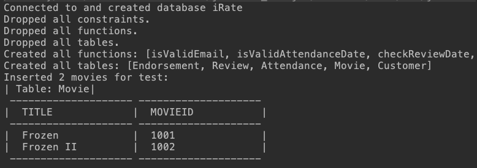
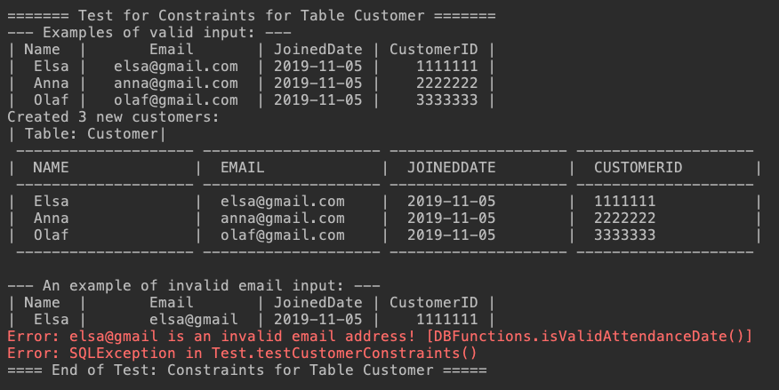
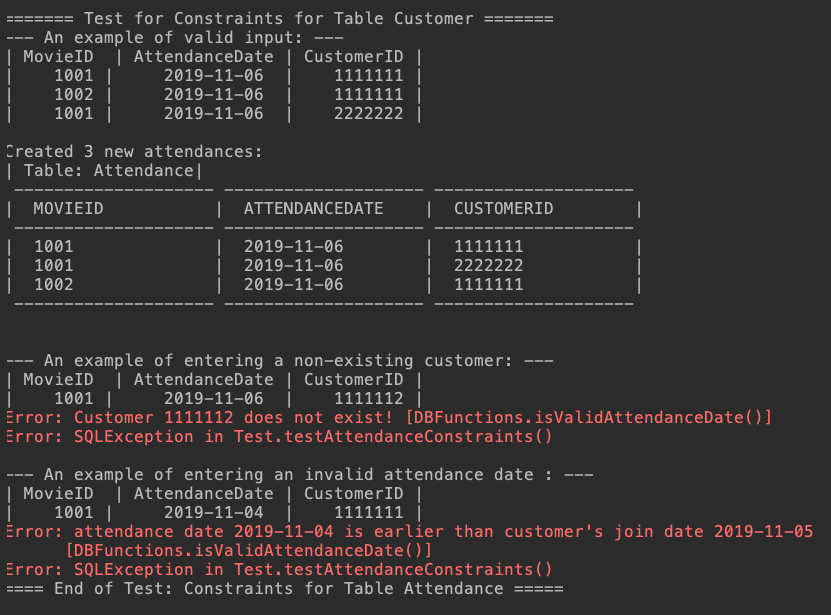
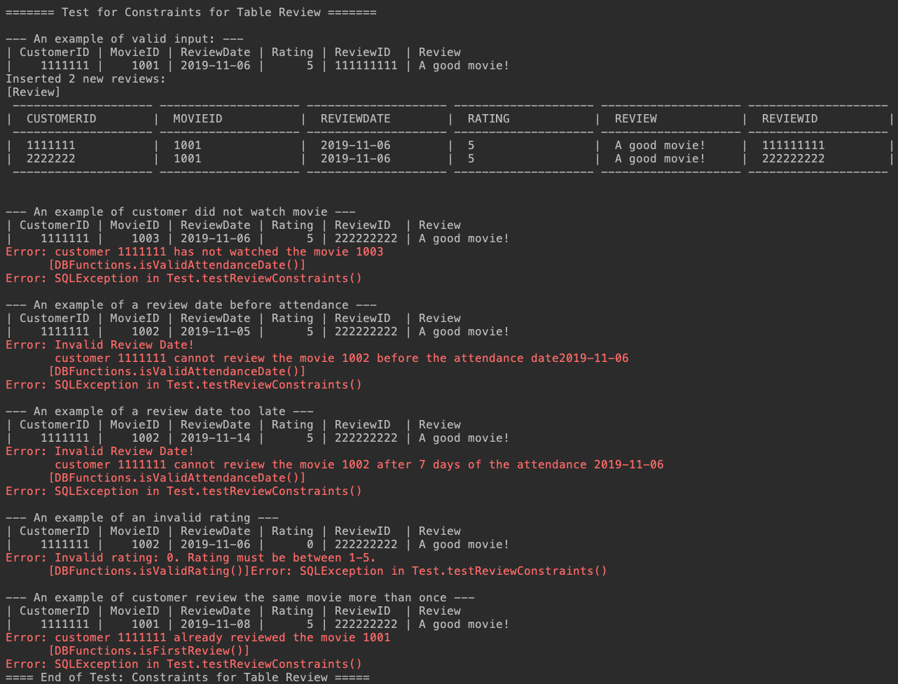
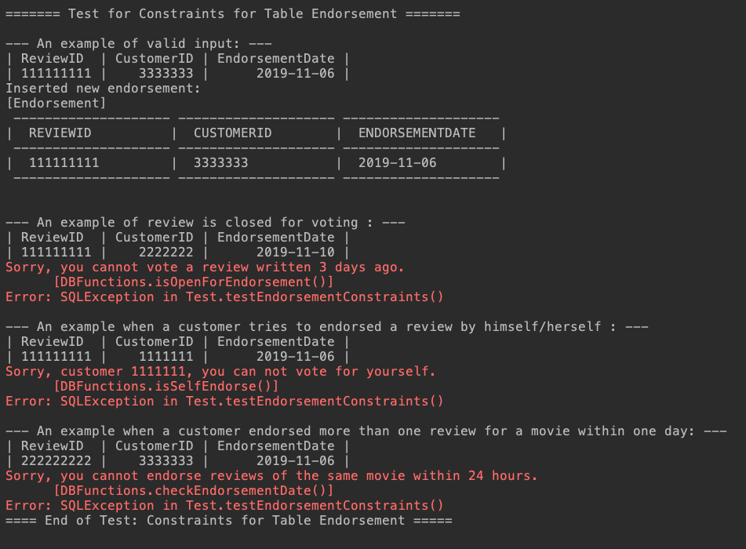

## Test Result of Part I:

You can run test of DB Functions by running `Test.java`, which checks constraints of each table.

The functions and output results are listed below:

#### 0. Initialization:

- Created tables by calling `Tables.initializeAll()`.
- Inserted test movies by calling `Test.insertTestMovies()`.

#### 1. Check constraints for Table `Customer`

- Insert 3 valid customers. 

- Check constraint: invalid email format
- Output test results:

#### 2. Check constraints for Table `Attendance`

- Insert 3 valid attendances.
- Check constraint: a customer cannot attend a movie before registration.
- Output test results:

#### 3. Check constraints for Table `Review`

- Insert 2 valid reviews.
- Check constraint: date of the review must be within 7 days of the most recent attendance of the movie.
- Check constraint: There can only be one movie review per customer.
- Check constraint: `rating` must be between 0 and 5.

- Output test results:

#### 4. Check constraints for Table `Endorsement`

- Insert 1 valid endorsement.
- Check constraint: a customer cannot endorse his or her own review.
- Check constraint: the review should be opened for voting.
- Check constraint: a customer cannot endorse more than one review for a movie within one day.

- Output test results:

